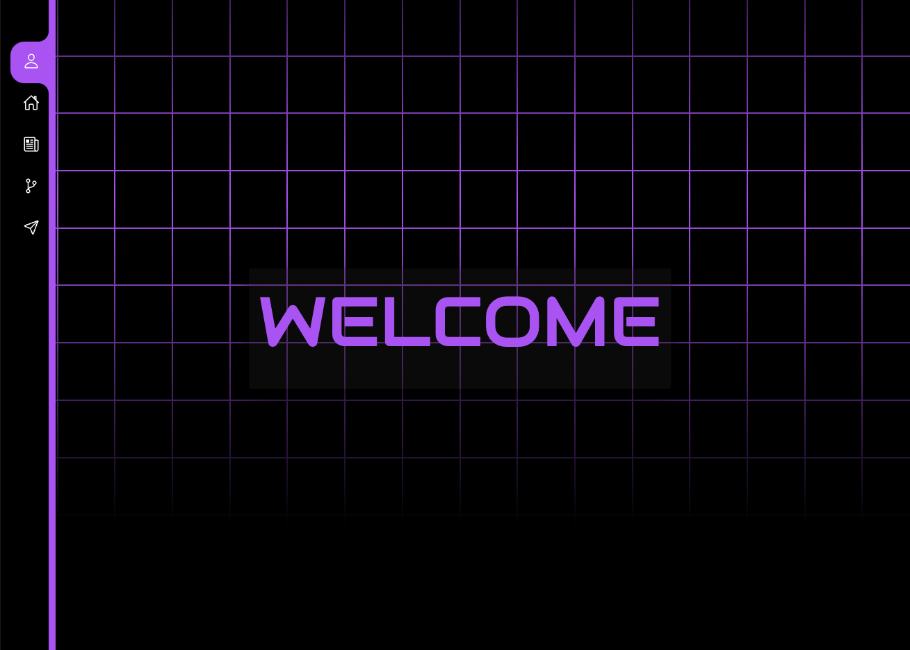

# Victoria Alawi - Portfolio

Welcome to the repository of my personal portfolio! My name is Victoria Alawi, and I am a full-stack developer with a passion for creating beautiful and functional websites. This portfolio showcases a range of my projects, skills, and experiences in web development.

## Overview

This portfolio is a culmination of my work, highlighting my skills in web design and development. It provides an interactive way for potential clients or employers to view my projects, learn about my background, and get in touch with me. The user interface is designed to be intuitive, providing a seamless browsing experience.

## Table of Contents

- [Features](#features)
- [Usage Guide](#usage-guide)
- [Screenshots](#screenshots)
- [Technologies Used](#technologies-used)
- [Live Demo](#live-demo)
- [Credits](#credits)
- [License](#license)

## Features

- **Interactive UI**: Users can interact with the portfolio through various UI elements, showcasing my projects in a dynamic way.
- **Responsive Design**: The portfolio is designed to be responsive, ensuring a smooth user experience on devices of all sizes.
- **Project Showcase**: Each project is highlighted with a brief description, technologies used, and links to the live demo and the code repository.
- **Contact Form**: A contact form is included for potential clients or employers to reach out to me directly from the portfolio.
- **Resume Download**: Users have the option to download my resume directly from the portfolio.

## Usage Guide

- **Navigation**: Use the navigation bar to browse through different sections of the portfolio, including Home, Resume, Projects, and Contact.
- **Interactive Project Display**: Hover over the project images to view more details and access links to the live demo and code repository.
- **Contact Form**: Fill out the contact form with your name, email, and message to get in touch with me. I will respond as soon as possible.

## Screenshots

## Technologies Used

- React
- CSS / JavaScript
- Nodemailer
- AWS S3
- Netlify

## Live Demo

Check out the live version of this project [here](https://victoria-alawi-portfolio.netlify.app/).

## Credits

This project was independently developed by myself, Victoria Alawi.

- Github: [@lightoftwelve](https://github.com/lightoftwelve)
- Portfolio : [Victoria Alawi's Portfolio](https://victoria-alawi-portfolio.netlify.app/)
- LinkedIn: [@Victoria Alawi](https://www.linkedin.com/in/victoria-alawi-872984250/)
- Website: [www.lightoftwelve.com](http://www.lightoftwelve.com)

## License

This project is not currently licensed.
